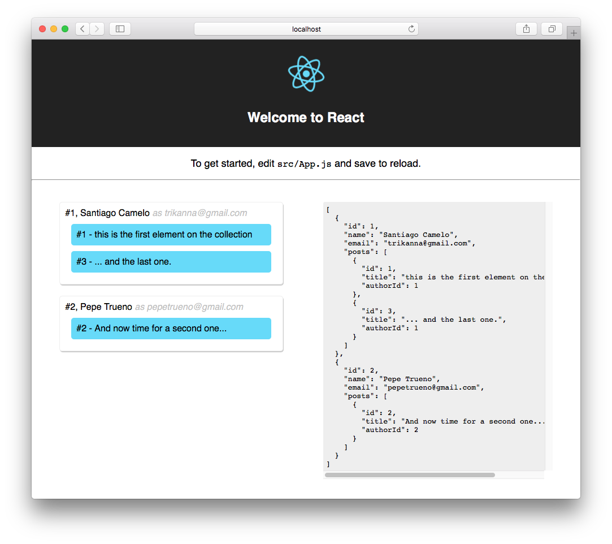

# create-react-app + json-server

This project was bootstrapped with [Create React App](https://github.com/facebookincubator/create-react-app) & [typicode/json-server](https://github.com/typicode/json-server)



## setup

```npm install``` & ```npm start```

### db.json

```json
{
  "posts": [
    {
      "id": 1,
      "title": "this is the first element on the collection",
      "authorId": 1
    },
    {
      "id": 2,
      "title": "And now time for a second one...",
      "authorId": 2
    },
    {
      "id": 3,
      "title": "... and the last one.",
      "authorId": 1
    }
  ],
  "authors": [
    {
      "id": 1,
      "name": "Santiago Camelo",
      "email": "trikanna@gmail.com"
    },
    {
      "id": 2,
      "name": "Pepe Trueno",
      "email": "pepetrueno@gmail.com"
    }
  ]
}
```

### api call

```http://localhost:4000/authors?_embed=post```